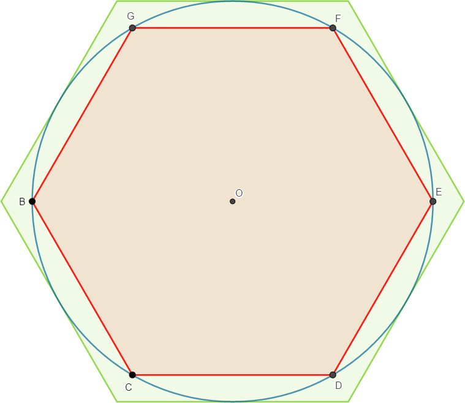
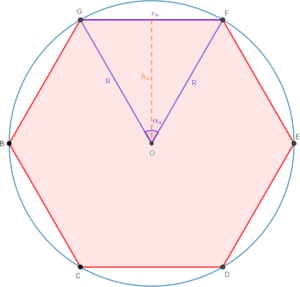

# Calculation Of Pi Frames.

Create the 08/10/2023 at 9:34pm in Rodez, France. By maxence-depire 

This repo talk about a little python script who computes two frames of the number Pi. I have created this because my math professor have try to teach me the Archimedes method, and I try to replicate it with code. 
Thanks the math professor.

# The methods
The goal is two computes two frames of Pi, a minimal, and a maximals frames. And we gonna solve this with a circle, and two polygons with the samed number of sides.

    

 

In this image, we have a little polygon in the circle, and a big polygon around the circle. We know that the size of the circle area is equal to `pi x Diameter`, if we take a diameter of `1`, we got `pi`. So the polygon in the circle of diameter one, is smaller than the polygon arround the circle. And the two frames of `pi`, is equal the size of the area of the both polygons.

## Little one.
For compute the area of the little polygon we gonna split in many triangle, and we re-split a of triangle that we obtains. We normaly obtains a rectangular triangles.

    

 

So we can now compute the size area of a rectangular triangle.